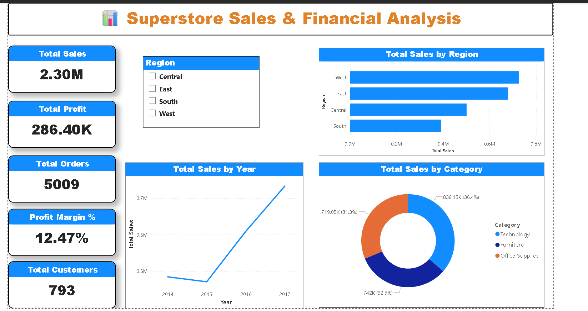
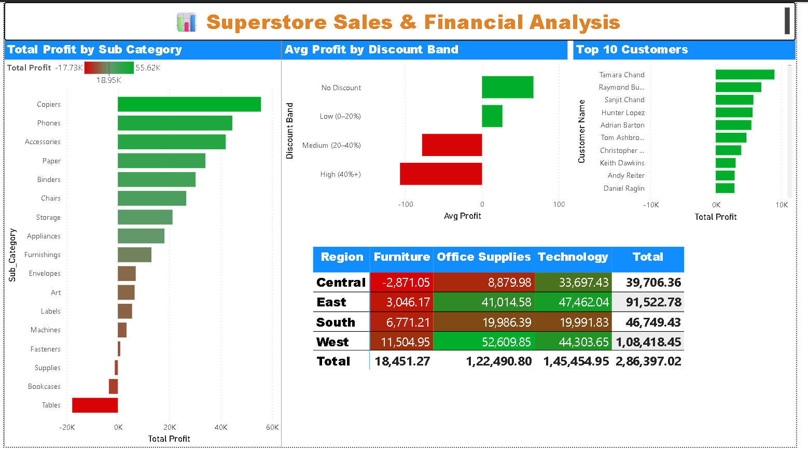
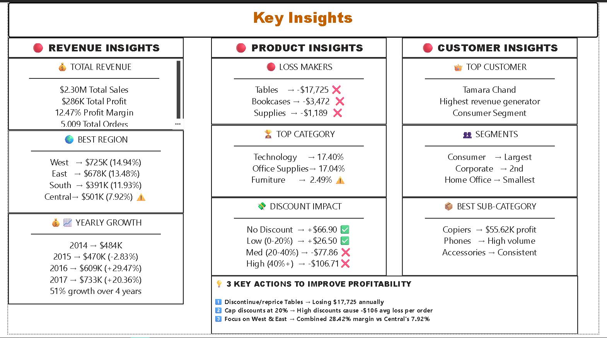

# 📊 Superstore Sales & Financial Analysis

## 🎯 Project Overview
An end-to-end data analysis project analyzing **9,994 sales 
transactions** from a US-based Superstore across 4 regions, 
3 categories, and 17 sub-categories using Python, MySQL, 
and Power BI.

The goal was to identify revenue gaps, loss-making products, 
discount impact on profitability, and growth trends — and 
present findings through an interactive 3-page dashboard.

---

## 🛠️ Tools & Technologies
| Tool | Purpose |
|------|---------|
| Python (Pandas, Matplotlib, Seaborn) | Data cleaning, EDA, visualization |
| MySQL | KPI queries, aggregations, rankings |
| Power BI (DAX, Power Query) | Interactive dashboard |
| Jupyter Notebook | Python analysis environment |
| GitHub | Version control & project sharing |

---

## 📁 Project Structure
```
Superstore-Sales-Financial-Analysis/
├── superstore_eda.ipynb        ← Python EDA notebook
├── superstore_queries.sql      ← All MySQL KPI queries
├── Krishna_Jaiswal_Superstore_Analysis.pbix  ← Power BI file
├── Krishna_Jaiswal_Superstore_Analysis.pdf   ← Dashboard PDF
├── screenshots/
│   ├── page1_sales_overview.png
│   ├── page2_product_analysis.png
│   └── page3_key_insights.png
└── README.md
```

---

## 📊 Dashboard Pages
| Page | Description |
|------|-------------|
| Sales Overview | KPI cards, Sales by Region, Category, Yearly trend |
| Product Analysis | Sub-category profit/loss, Discount impact, Top 10 customers, Region-Category matrix |
| Key Insights | All findings + 3 actionable business recommendations |

---

## 🔑 Key Findings

### 💰 Revenue Insights
- **Total Sales:** $2,297,200 across 5,009 orders
- **Total Profit:** $286,397 with **12.47% profit margin**
- **Total Customers:** 793 across 4 regions
- **West region** leads with $725K sales & 14.94% margin
- **Central region** weakest with only 7.92% profit margin

### 🔴 Loss Making Sub-Categories
| Sub-Category | Loss |
|---|---|
| Tables | -$17,725 |
| Bookcases | -$3,472 |
| Supplies | -$1,189 |

### 💸 Discount Impact on Profit
| Discount Band | Avg Profit per Order |
|---|---|
| No Discount | +$66.90 ✅ |
| Low (0-20%) | +$26.50 ✅ |
| Medium (20-40%) | -$77.86 ❌ |
| High (40%+) | -$106.71 ❌ |

### 📈 Yearly Growth
| Year | Revenue | Growth |
|---|---|---|
| 2014 | $484,247 | — |
| 2015 | $470,532 | -2.83% |
| 2016 | $609,205 | +29.47% |
| 2017 | $733,215 | +20.36% |

**51% total revenue growth from 2014 to 2017**

### 🏆 Category Performance
- **Technology** → 17.40% margin ← Most profitable
- **Office Supplies** → 17.04% margin
- **Furniture** → 2.49% margin ← Needs attention

---

## 💡 Business Recommendations
1. **Discontinue or reprice Tables** → Losing $17,725 
   annually despite $206K in sales
2. **Cap discounts at 20%** → Any discount above 20% 
   results in negative average profit per order
3. **Focus on West & East regions** → Combined margin 
   of 28.42% vs Central's 7.92%

---

## 📸 Dashboard Preview

### Page 1 — Sales Overview


### Page 2 — Product Analysis


### Page 3 — Key Insights


---

## 🐍 Python EDA Highlights
- Loaded and cleaned 9,994 transaction records
- Created Discount Band and Profit Status columns
- Analyzed regional, category and sub-category performance
- Visualized discount impact and yearly revenue trends
- Identified 3 loss-making sub-categories

## 🗄️ SQL KPI Queries
- Overall KPIs (Sales, Profit, Margin, Orders)
- Regional performance analysis
- Loss-making sub-category identification
- Discount band impact analysis
- Top 10 customer rankings
- Yearly revenue trend analysis
- Best and worst performing states

---

## 👤 Author
**Krishna Jaiswal**
Data Analyst | Pune, Maharashtra, IN
- 🔗 [LinkedIn](https://www.linkedin.com/in/krishna-jaiswal-83779531a/)
- 💻 [GitHub](https://github.com/Krxxai)
- 📧 krishnajaiswal0904@gmail.com
